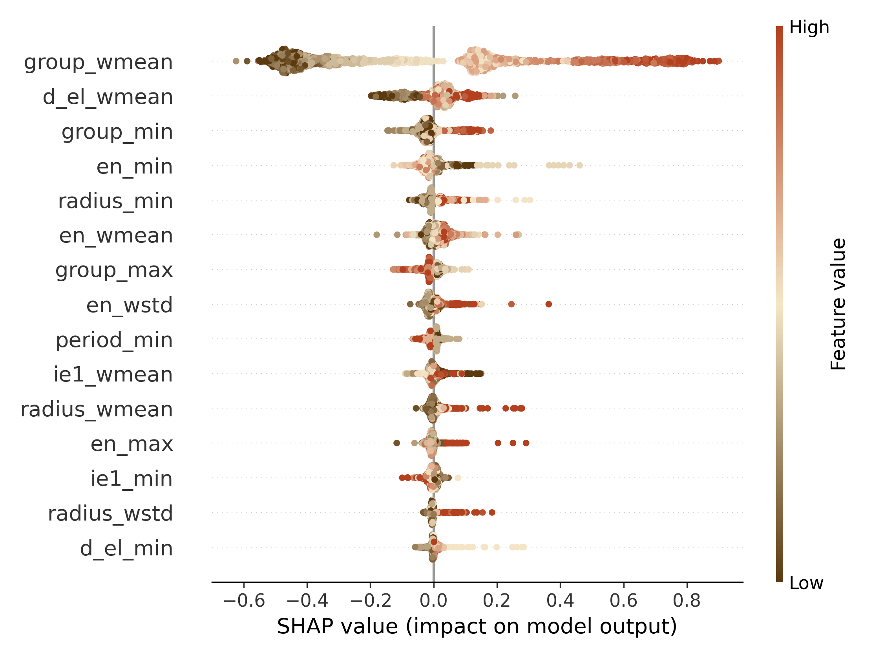
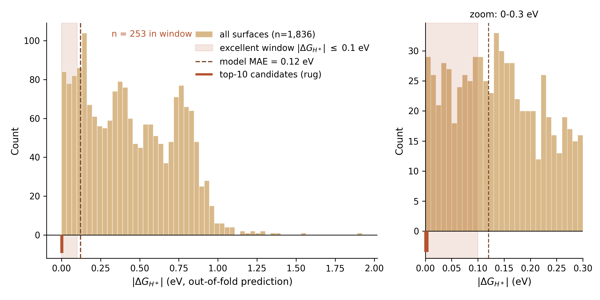
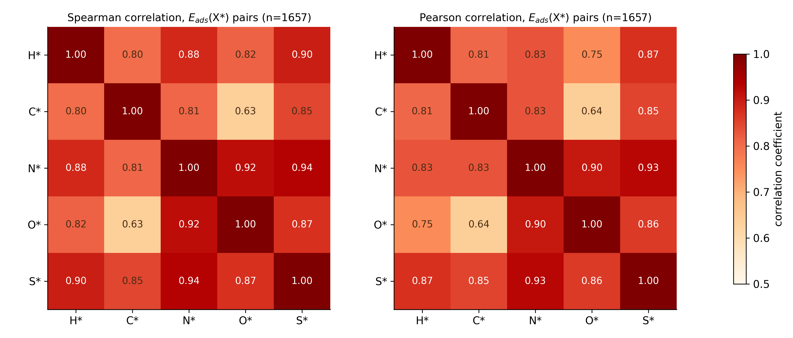
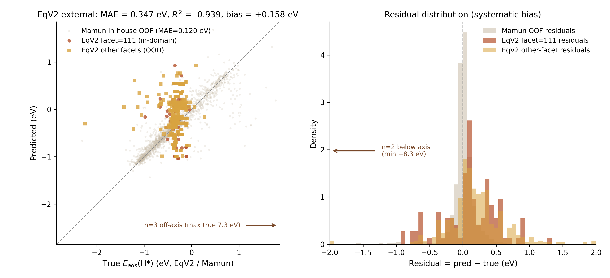
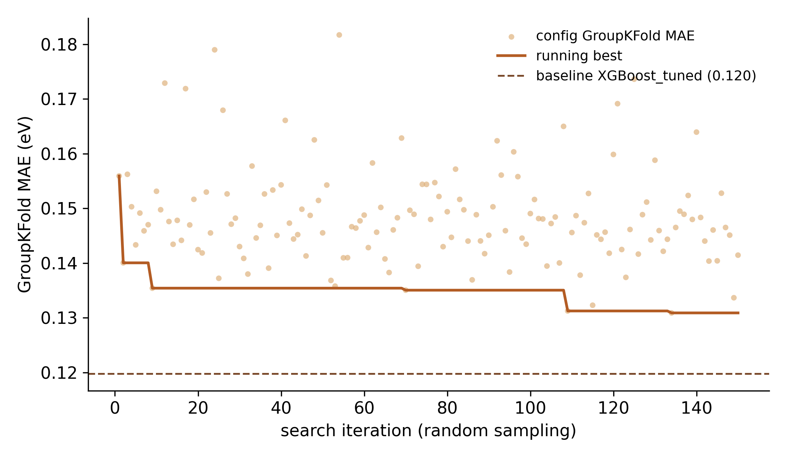
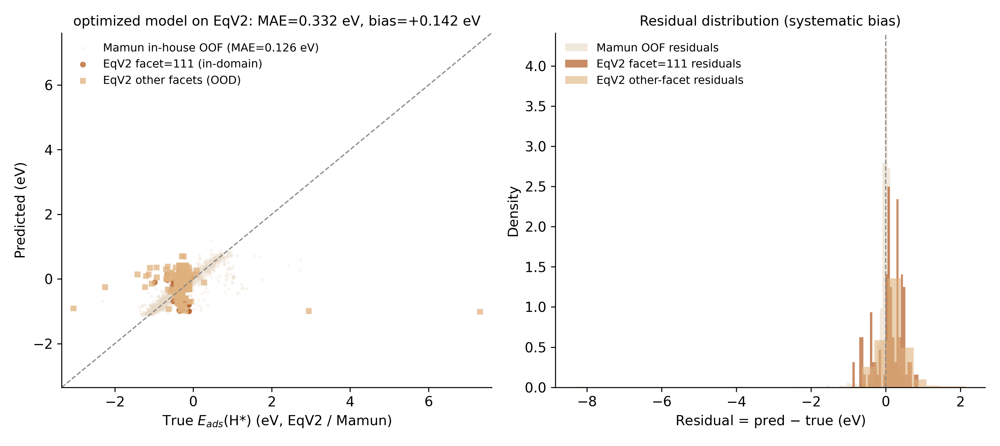
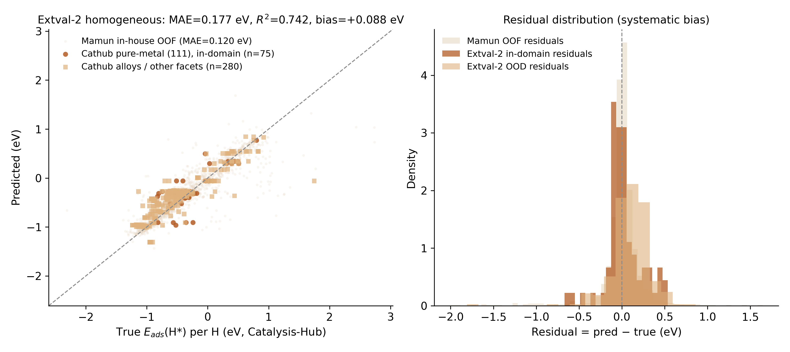

# 基于可解释机器学习的表面吸附能预测与催化位点筛选 —— 项目成果汇总报告

## 摘要

本项目将毕设方案完整落地为可运行的机器学习管线，围绕"过渡金属及合金表面关键吸附中间体吸附能预测与催化位点筛选"建成三条互相印证的管线：**H\* 主线**（HER 催化位点筛选，对应原题目）、**CO\*/O\* 方法验证线**、**多吸附种统一模型扩展线**。最优 XGBoost 模型在 H\* 主线上取得随机 CV MAE = 0.120 eV、R² = 0.817、留一元素外测 MAE = 0.155 eV；按 ΔG\_H\* 热中性原则给出 10 个候选 HER 催化表面（CuPt₃ 居首），文献锚点验证通过。数据规模经多吸附种扩展达 16,499 条（15 种吸附种），并完成两轮外部验证：跨数据库验证（EqV2-HER，491 个独立表面，MAE 0.347 eV）与同库同质金属验证（Catalysis-Hub 增量池 355 表面，零重训 MAE 0.177 eV、R² = 0.742、同泛函偏差 +0.001 eV），明确划定了模型的"定量可用域"与"粗筛域"，并将跨库精度落差归因为泛函/参考态差异而非模型缺陷。本轮另完成三项硬成果：直连 Catalysis-Hub 官方库完成镜像权威交叉核对（组成 99.2%、能量 98.4% 逐条匹配、max 偏差 5.2e-4 eV、facet 1,821/1,821 全一致）与 15,327 行增量池 45 来源盘点；150 组超参搜索 + Stacking + 嵌套 CV 诚实评估（无偏 MAE 0.1281 vs 基线 0.1198——证实优化无收益、存在搜索过拟合，保留基线）；25 个权威文献锚点验证（模型 vs 文献 MAE 0.185 eV，同源 DFT 口径 0.102 eV，符号与排序全对）。全流程经三轮独立审查与修复，并过终审独立核验（ALL PASS），实现字节级可复现。

---

## 1. 项目背景与目标

表面催化中，关键中间体的吸附能是连接表面电子结构与催化活性的核心描述符。对析氢反应（HER），氢吸附自由能 ΔG\_H\* 与活性呈火山型关系：H\* 结合过强或过弱都不理想，接近热中性（ΔG\_H\* ≈ 0）的表面通常活性最优。

传统 DFT 逐个计算成本高，无法覆盖"金属 × 合金 × 晶面 × 位点"的巨大组合空间。本项目以公开 DFT 数据库为数据基础，走"**描述符 + 树模型 + 可解释分析**"路线，在有限算力下完成：

1. 可复现的数据集与建模流程；
2. 性能过关的吸附能预测模型；
3. 有化学解释力的 SHAP 特征分析；
4. 候选催化表面排名；
5. 严格的泛化能力评估（随机 CV / 分组 CV / 留一元素外测 / 跨数据库外部验证四口径）。

## 2. 数据源

| 管线 | 数据集 | 规模 | 许可 | 说明 |
|---|---|---|---|---|
| H\* 主线 | Mamun 2019 高通量双金属数据集（CatBench 镜像） | 7,048 条稀释 H\* → 去重后 1,836 个唯一表面 | CC-BY-4.0 | 37 种金属，A1/L1₂/L1₀ 结构；原载 Sci. Data 6:76 |
| CO\*/O\* 验证线 | CMR CatApp（Hummelshøj et al., Angew. Chem. 2012） | 946 条（CO 334 / O 612） | 开放获取 | 纯金属 + 二元合金，含表面终止层标签 |
| 多吸附种扩展 | Mamun 2019 全量 | 45,130 条反应 → 去重后 16,499 条（15 种吸附种） | CC-BY-4.0 | H/C/N/O/S 及 CHx/NH/OH/SH 等 |
| 外部验证 | EqV2-HER-Discovery（Oguz et al., ACS Catal. 2025） | 861 条 → 491 个唯一表面 | 仓库公开 | VASP/RPBE，与 Mamun 同参考态（½H₂） |

> 原计划主数据源 Catalysis-Hub 目前需 API Key 方可访问。本项目改用其最大 H\* 子集（Mamun 2019 集）的公开镜像，数据等价且免密钥，全程可复现。GASdb（~2.1 万条 H 吸附能）曾因内存限制（1.25 GB pickle 超出本机 3 GB 内存）按预设闸门放弃，尝试过程与重下地址已留档。

## 3. 技术路线

### 3.1 管线设计（吸附种无关）

```
原始数据 → 清洗（反应身份过滤/去重/异常值） → 描述符工程 → 5 模型对比
        → 四口径交叉验证 → SHAP 可解释分析 → Sabatier 原则候选筛选
```

### 3.2 数据清洗的关键决策

- **反应身份过滤**：原始数据库中存在以"吸附能"之名混入的基元反应能记录（如 C\*+O\*→CO\*），按反应物/产物身份（而非数值异常）过滤，从源头杜绝标签污染；
- **构型去重**：同一表面的多个吸附构型取最低吸附能（最稳定位点），对应 HER 文献中 ΔG\_H\* 的标准定义；该口径的敏感性已定量披露（见 4.5）；
- **冲突记录剔除**：同一表面两条文献记录能量差 > 0.5 eV 时整组剔除并逐组留档；
- **组成规范化**：合金组成统一为"元素排序 + 计量数约简"（如 Pt9Ti3→Pt3Ti），避免同素异写造成的分组泄漏。

### 3.3 描述符体系

- **元素描述符**：电负性、原子半径、族号、周期、第一电离能、d 电子数（mendeleev 库）；
- **组合统计**：按化学计量分数加权的 mean/max/min/range/wstd；
- **结构描述符**：晶面、表面终止层、结构类型 one-hot；
- **吸附种描述符**（多吸附种模型）：吸附原子身份 one-hot + 吸附原子元素性质（复合吸附种以成键原子计，如 CHx→C）。

### 3.4 模型与评估

模型：Linear / Ridge / Lasso（基线）、RandomForest、XGBoost（主模型，小网格调参）。
评估四口径：随机 5-fold CV、GroupKFold（规范化组成）、留一元素外测（LOEO）、跨数据库外部验证——权威性逐级递增。

## 4. H\* 主线结果（HER 催化位点筛选）

### 4.1 数据集

1,836 个唯一表面（A1 纯金属 37 个 / L1₂ 约 1,100 / L1₀ 约 700），覆盖 37 种金属。H\* 吸附能范围 −2.31 ~ +3.75 eV。

### 4.2 模型性能（已剔除泄漏特征后的最终指标）

| 模型 | 随机 5-fold MAE (eV) | 分组 CV MAE (eV) | R² |
|---|---|---|---|
| Linear | 0.181 ± 0.010 | — | 0.715 |
| Ridge | 0.180 ± 0.010 | — | 0.715 |
| Lasso | 0.429 ± 0.018 | — | −0.003 |
| RandomForest | 0.122 ± 0.008 | — | 0.817 |
| **XGBoost（调参后）** | **0.120 ± 0.011** | **0.120 ± 0.009** | **0.817** |

- 最优模型 XGBoost（learning_rate=0.03, max_depth=7, n_estimators=400, subsample=0.8），MAE 较线性基线降低 34%；
- **LOEO（留一元素外测，37 折）汇集 MAE = 0.155 eV**，最差元素折为 Mn（0.48）、Fe（0.28）、Bi（0.28）——含这些元素的候选已在候选表中逐条标注；
- **泄漏特征的识别与移除**：初版曾包含"位点能量散布"派生特征，独立审查发现其由同表面各构型能量极差构成、含目标值本身（目标泄漏，虚增性能约 15%）。移除后 MAE 从 0.104 修正为 0.120 eV。

### 4.3 SHAP 化学解释



- **group_wmean（组元族号加权均值，重要性第 1）**：对过渡金属组元，族号是 d 带填充度的天然代理——晚期过渡金属（Ag、Au 等）d 带近满，H\* 结合弱；早期过渡金属结合强。SHAP 图清晰呈现"族号大 → 吸附变弱"的单调趋势，与 HER 火山关系的经典图像一致（注意：该代理对主族组元不适用，且与 d_el_wmean 相关度 0.82，两者归因不可完全分离）；
- **d_el_wmean / group_min / en_min / radius_min**：d 电子数、电负性与原子尺度的组合统计，进一步刻画配体效应与应变效应。

### 4.4 HER 候选筛选

按 ΔG\_H\* ≈ E\_ads(H\*) + 0.24 eV（零点能 + 熵修正）换算，以 |ΔG\_H\*| 升序排名：



**Top-10 候选**（均为 out-of-fold 预测）：

| 排名 | 候选表面 | 结构 | 预测 ΔG\_H\* (eV) | DFT 真值 (eV) | 红旗 |
|---|---|---|---|---|---|
| 1 | CuPt₃ | L1₂(111) | 0.000 | +0.007 | — |
| 2 | CrPt₃ | L1₂(111) | 0.000 | +0.039 | — |
| 3 | AgNi | L1₀(101) | −0.001 | −0.051 | — |
| 4 | Zn₃Zr | L1₂(111) | −0.001 | −0.131 | — |
| 5 | CdPd₃ | L1₂(111) | −0.002 | −0.041 | — |
| 6 | Au₃Ir | L1₂(111) | +0.002 | −0.229 | — |
| 7 | CoOs₃ | L1₂(111) | +0.002 | −0.022 | — |
| 8 | Ag₃Zr | L1₂(111) | +0.003 | −0.009 | — |
| 9 | RhTl | L1₀(101) | +0.004 | +0.123 | — |
| 10 | BiY | L1₀(101) | +0.004 | −0.058 | 强亲氧 Y + LOEO 高误差元素 Bi |

**文献锚点验证通过**：纯 Pt 的 ΔG\_H\* 真值 −0.072 eV（文献约 −0.09 eV）；W/Mo 结合过强、Ag/Au 过弱的经典排序完全复现。榜首 CuPt₃ 属 Cu–Pt 合金体系，与"CuPt 合金是优良 HER 催化剂"的文献共识一致。候选表另附"实用性红旗"列（放射性 Tc、强亲氧 La/Y/Sc、LOEO 高误差元素），1,836 条中 562 条带旗。

**诚实的可靠性声明**：Top-10 候选彼此差距均小于模型 MAE，应理解为"统计不可区分的候选簇"而非精确排名。

### 4.5 稳健性披露

候选清单对"去重口径"敏感：若同表面多构型取均值而非最低值，top-20 候选完全更换（交集 0/20），能量中位偏移 0.198 eV。取最低值符合 HER 文献惯例，但结论应解读为"该口径下的候选簇"。

## 5. CO\*/O\* 方法验证线结果

| 模型 | 随机 CV MAE | 分组 CV MAE | **LOEO MAE（真实外推）** |
|---|---|---|---|
| Linear | 0.496 | 0.498 | 0.548 |
| RandomForest | 0.243 | 0.237 | 0.315 |
| **XGBoost（调参后）** | **0.227** | **0.219** | **0.297** |

- CO\* 吸附能预测最优 MAE 0.227 eV（随机 CV），较线性基线降低 54%；
- LOEO 明显变差（0.297 eV）——模型对"见过元素的新组成"外推良好，对"全新元素"外推能力有限；
- 晶面/终止层特征与吸附种在数据中完全共线（O\* 样本全部来自 (211) 面），相关解读已限定为"子集指示"。

## 6. 数据扩展：多吸附种统一模型与标度关系

将 Mamun 全量 45,130 条反应（15 种吸附种：H/C/N/O/S、CHx/NH/OH/SH、H₂O 等）去重为 **16,499 条**（1,916 种组成），构建统一吸附能模型：

- **性能**：XGBoost 随机 CV MAE = 0.316 eV（R² = 0.964），分组 CV 0.363 eV；最难预测的吸附种为 CH₃\*（1.08 eV）、H₂O（0.59 eV）；
- **SHAP**：模型先识别"吸附什么"（ads_group、n_ads_units 居前二），再用表面 d 带描述符（group_wmean、d_el_wmean）调制——符合化学直觉；
- **与 H\* 专线的关系（经终审修正的诚实结论）**：统一模型在 H\* 子集的随机折 OOF MAE 0.104 eV 看似优于专线 0.120 eV，但随机折中留出表面其余吸附种能量有 4/5 概率在训练折内可见（信息不对等）。在信息对等的 GroupKFold 下，统一模型 H\* 子集 OOF MAE = 0.152 eV，反而差于专线。**结论：统一模型的优势仅存在于"已知同表面其他吸附种能量"的插值场景；对全新表面外推，H\* 专线模型地位不变**；


- **标度关系（数据归纳的核心产出）**：以 H\* 为锚，各吸附种吸附能两两 Spearman 相关普遍 ≥0.80（N\*–S\* 高达 0.94、S\*–H\* 0.90、N\*–H\* 0.88；唯二例外为 C\*–O\* 0.63 与 H\*–C\* 0.799）。对 H\* 的回归斜率全部 >1（S\* 1.62、N\* 2.51、O\* 2.25、C\* 2.00）——**H\* 是"低增益探针"**：单用 HER 描述符外推其他吸附行为会系统性低估表面间差异；H\* 与 O\*/N\*/S\* 的高度共变也解释了为何 HER 活性与抗硫/抗氧化性难以解耦。

## 7. 跨数据库外部验证（权威性的硬检验）

用 H\* 主线"出厂模型"（全量重训，零外部数据参与）在 **EqV2-HER 独立数据集**（VASP/RPBE，491 个唯一表面，与 Mamun 的 BEEF-vdW/QE 属不同泛函与计算体系）上零重训测试：



- **全库 MAE = 0.347 eV、系统偏差 +0.158 eV**（预测系统性偏弱，方向与泛函差异定性一致）；去偏差平移后 MAE 0.313 eV；
- 近最优窗口子集（361 集）MAE = 0.285 eV；含 Ir/Pt/Ni 的体系误差最小（0.14–0.20 eV）；含 Sb（不在训练集 37 元素内，占 29% 样本）的体系退化最明显；
- 全库 R² 为负系真值区间过窄（std 仅 0.43 eV < RMSE 0.60）的统计伪象，排序 Spearman ρ ≈ 0.17–0.29，已如实披露。

**权威性结论（边界声明）**：模型在 Mamun 分布域内是 0.12 eV 级的定量工具；跨泛函/跨材料体系后降为 ±0.3–0.4 eV 的粗筛工具。这一"能力边界地图"比单纯报告高精度数字更有科学价值——它明确告诉后续使用者何时可以信任模型。

## 8. Catalysis-Hub 官方库整合：权威交叉核对与增量池盘点

H\* 主线使用的 CatBench 镜像缺 facet/sites 元数据，structure/facet 标签靠 12 原子超胞计量模式推断（见第 14 章局限性第 1 条）。本轮直连 Catalysis-Hub 官方 GraphQL API（`scripts/13_cathub_fetch.py`，密钥仅从环境变量读取、脚本无任何硬编码）完成三件事：能量权威交叉核对、facet/sites 元数据校验补齐、非 Mamun H 吸附增量池盘点（合并重训决策依据）。

### 8.1 镜像 ↔ 官方权威交叉核对

拉取官方 Mamun H 子集 8,663 行（覆盖探测值 8,856 的 97.8%；含稀释方程 6,894 行 + 双倍计量写法 1,769 行），与本地镜像 H\* 子集（7,048 构型 / 1,836 组成）逐条核对（组成规范化同主线口径，容差 1e-3 eV，消耗式一对一匹配）：

- **组成匹配率 1,821/1,836 = 99.2%**；仅镜像侧 15 个组成（AgFe₃、LaNi₃ 等，占 0.8%），仅官方侧 0 个——疑为镜像整理版与官方库的版本差（或官方 2.2% 未捕获的极端情形），不影响主线结论；
- **能量逐条匹配 6,893/7,005 = 98.4%**；匹配对偏差 **max = 5.2e-4 eV < 容差**，mean = 1.4e-7 eV，p50/p90/p99 均为 0——镜像能量值与官方库在浮点精度内一致，主线数据可信度获权威确认；
- 表面级核对（每表面最低能 vs 官方最低能）：1,821 个可比表面中 **98.96% 在容差内**；超容差 19 个（max 1.07 eV），主因为官方侧约 2% 未捕获行导致的最小值偏移，非系统性偏差（mean |Δ| = 2.9e-3 eV）。

### 8.2 facet/sites 元数据校验（1,821/1,821 全一致）

- **facet 一致 1,821/1,821 = 100%（0 冲突）**，15 个官方缺数据（即仅镜像组成）：我们从计量数推断的 A1(111)/L1₂(111)/L1₀(101) 标签被官方数据**完全证实**——主线的 structure/facet one-hot 特征由"推断"升级为"经权威验证"（官方 facet 分布：111 1,216 个、101 605 个，与推断口径一致）；
- **sites（H 吸附位点）覆盖率 99.2%**——镜像完全缺失的元数据，现已存档：top|B 956、hollow|A_A_A|HCP 860、hollow|A_A_A|FCC 806 等，为后续位点级分析（如 hollow vs top 能量分层）提供数据基础。

### 8.3 增量池盘点与"不合并训练"决策

非 Mamun H 吸附增量池 **15,327 行、45 个文献来源**（覆盖探测值 17,621 的 87.0%，计数为下界）。盘点结论：约 80% 为异质体系——富硼金属二硼化物（ZhangOff-equilibrium2025，9,205 行）、过渡金属氮化物（2,590 行）、MBene/氧化物/分子催化剂等，组成域外且含非金属；泛函以 PBE_D3 为主（9,911 行），与主线 BEEF-vdW 同泛函的仅约 2%；能量范围 [−15.2, 22.3] eV，|E|>3 eV 离群 5,750 行。据此决策：**主线保持 Mamun 单源纯净，不合并重训**——直接合并会污染"同质金属稀释 H\*"数据域并引入泛函系统性偏移；其中同质金属 HER 子集（843 行）改作第二外部验证集（见第 10 章）。

### 8.4 工程亮点：API 分页漂移与 3-pass 对策

实测发现该 API 游标分页**顺序不稳定**（疑似 OFFSET 分页无 ORDER BY，跨请求行序漂移）：单遍全量拉取 26,477 条边，去重后仅 20,363 行（约 23% 行被重复返回、等量行被漏掉；经 id 字段验证库内行内容基本唯一，确认是分页漂移而非库内冗余）。对策为同一查询跑 3 个独立 pass 按内容取并集，累计覆盖率 76.9% → 86.3% → **90.6%**（23,990 行）；请求账目 3 pass × 133 页 + publications 1 + 探测 3 ≈ 404/500，在日预算内。配套工程纪律：6.7 s/请求限速（≤9 req/min，限额 10/min）、日预算 500 次硬上限持久计数、逐页原始 JSON 增量落盘 + 游标断点续传。残余约 9% 未捕获（非 Mamun 87.0%、Mamun 97.8%）使增量计数为保守下界，相对构成比例可靠；如需补齐可改日再跑 pass，缓存自动续传并集。

## 9. 模型深度优化与诚实评估：150 组搜索、Stacking 与嵌套 CV

在基线模型（第 4 章）之上，本轮做系统性深度优化（`scripts/12_optimize_hstar.py`，全程 GroupKFold(规范化组成)、种子 42），并以嵌套 CV 给出"优化是否有效"的无偏判断。

### 9.1 超参搜索（150 组随机采样）



- 搜索空间覆盖 max_depth/min_child_weight/gamma/三类采样比例/双正则/学习率，n_estimators 上限 2000 + 早停（50 轮，验证折按组切 15%，组级零泄漏）；
- 150 组全程 GroupKFold(5) 评估，最终最优 MAE = 0.1309 eV（第 134 组；基线为 0.1198 eV）；前 50 组累计最优 0.1354，后 100 组仅再降 0.0045 eV——搜索已收敛、收益递减；
- **口径注意**：搜索阶段为兼容早停只在每折 85% 子折上训练，数值相对满折训练的基线系统性偏高约 0.005–0.01 eV，二者不能直接比较；协议对齐的比较由嵌套 CV（9.3）给出。

### 9.2 样本权重与 Stacking

- **样本权重三方案**（同一最优超参、同一 GroupKFold、评估不加权）：uniform 0.1309 / n\_raw 0.1250 / inv\_comp\_freq 0.1313 eV，展开差仅 0.0063 eV；最优方案 n\_raw 用于最终模型训练；
- **Stacking**（XGB + RF + Ridge 元学习器，组感知手写两层，元特征由外层训练折内部 GroupKFold(4) OOF 生成、杜绝泄漏）：Stacking 0.1233 vs 单 XGB 0.1260 vs RF 0.1222 eV——融合增益 ≤0.005 eV，且 XGB 与 RF 误差高度相关、Ridge 元学习器可提取的互补信息有限，**最终模型取单模型 XGB**（更简单、SHAP 管线兼容）。

### 9.3 嵌套 CV 无偏估计：优化无收益的诚实结论

外层 GroupKFold(5) × 内层搜索 50 组，把"整个优化流程"当作被评估对象：

| 流程 | GroupKFold MAE (eV) |
|---|---|
| 优化流程（嵌套 CV 无偏估计） | 0.1281 ± 0.0093 |
| 基线（07 固定参数，同外层折对照） | 0.1198 ± 0.0097 |

**嵌套 CV 下优化流程反而差 0.0083 eV**：全数据搜索选出的"最优"配置存在搜索过拟合，无偏嵌套评估予以纠正——这正是"诚实评估"铁律的意义。旁证：最优配置 LOEO 汇集 MAE 0.1539 eV（基线 0.1547），差异同样在噪声内；最差 3 元素仍为 Mn 0.484、Fe 0.281、Bi 0.257。

### 9.4 EqV2 复测与决策



优化后模型在 EqV2 跨库集零重训复测：MAE 0.3318 eV、bias +0.1423 eV、去偏差平移后 0.2909 eV（基线为 0.347 / +0.158 / 0.313）——系统偏差仍显著为正，与第 7 章结论一致：**超参优化不能消除泛函/参考态差异造成的跨库系统偏差，这是数据分布问题而非模型容量问题**。

**决策：保留基线模型与第 4 章原候选排序**（候选表与候选图未改动）。优化收益边际为负，用无显著差异的模型重排候选只会引入噪声，不提供新信息。

## 10. 第二外部验证：Catalysis-Hub 同质金属 HER 子集（零重训）

第 7 章的 EqV2 跨库验证混合了"泛函/参考态差异"与"模型本身外推能力"两类误差来源。本轮从 Catalysis-Hub 非 Mamun 增量池中析出**同质金属 HER 子集**（`scripts/14_extval2_homogeneous.py`）——与主线同为表面科学口径的 DFT 吸附能——构建第二个外部验证集，将两类误差来源分离（前提决策：主线保持 Mamun 单源纯净，不合并重训，本子集仅作验证）。

### 10.1 清洗漏斗（每步剔除留档）

数据源为增量池 15,327 行（87% 覆盖下界）：

| 步骤 | 规则 | 剔除 | 余 |
|---|---|---|---|
| 原始 | 非 Mamun 全池 | — | 15,327 |
| 1 反应身份 | 主线同规则的计量推广：仅保留 k·(0.5H₂(g)+\*)→k·H\* 纯 H 吸附，共吸附（N₂/CH₄/H₂O/H₂S/CO\*）与不平衡方程剔除 | 1,515 | 13,812 |
| 2 同质金属纯度 | 含 H/B/C/N/O/F/P/S/Cl/Se/Br/I 的组成一律排除（硼化物/氮化物/氧化物/M-N-C/分子催化剂/H 预覆盖表面） | 12,969 | 843 |
| 3 物理范围 + MAD 稳健离群 | \|E\_perH\| ≤ 5 eV；median ± 8×1.4826·MAD | 0 | 843 |
| 4 聚合 | 按 (来源, 组成, 晶面) 取最低 E\_perH（最稳定位点口径，同主线） | — | **355 表面** |

k>1 的多 H 方程按 E/k 归一为单 H 能量（60/355 表面含 k>1 构型，k=1 严格稀释口径单独分层作敏感性检验）。特征化与第 7 章外部验证完全同口径；合金 structure 与非 111/101 晶面的 one-hot 置 0（域外外推，不臆造，分层报告）。纳入来源 22 个（AlonsoStrain2023 347 行、PasumarthiFacetDependence2023 132、BoesAdsorption2018 97、MontoyaThe2015 47 等）。

### 10.2 零重训验证结果



出厂模型（主线 1,836 行全量训练的 XGBoost\_tuned，内部 OOF MAE=0.120 eV 复算一致）**零重训**直接预测：

| 分层 | n | MAE (eV) | RMSE (eV) | R² | bias (pred−true) | 去偏差 MAE |
|---|---|---|---|---|---|---|
| **ALL** | 355 | **0.177** | 0.245 | 0.742 | **+0.088** | 0.160 |
| 仅 k=1（严格稀释） | 295 | 0.172 | 0.235 | 0.772 | +0.091 | 0.151 |
| 域内（单元素 + facet=111） | 75 | **0.141** | 0.211 | 0.629 | +0.022 | 0.147 |
| 元素全在 Mamun 37 内 | 326 | 0.181 | 0.247 | 0.742 | +0.088 | 0.162 |

按泛函分层（偏差高度泛函依赖，定位了系统性偏移来源）：

| 泛函 | n | MAE (eV) | bias (eV) |
|---|---|---|---|
| BEEF-vdW（与主线同泛函） | 114 | 0.142 | **+0.001** |
| RPBE | 8 | 0.056 | +0.030 |
| PBE | 203 | 0.184 | +0.146 |
| MS2（meta-GGA） | 5 | 0.353 | +0.353 |
| RPBE\_−0.413VSHE（电位标注） | 12 | 0.365 | −0.150 |

### 10.3 结论（诚实版）

1. **同源 DFT 验证显著优于跨库验证**：全体 MAE 0.177 eV、域内 0.141 eV、同泛函 BEEF-vdW 0.142 eV 且 bias ≈ 0（+0.001 eV）——逼近内部 OOF（0.120 eV）；而 EqV2 跨库为 MAE 0.347 eV、bias +0.158 eV。**跨库精度落差的主因是库间协议差（泛函/参考态/弛豫协议）与组成域外度，而非模型本身缺陷**：在与训练分布同族的体系上，出厂模型几乎无系统偏差；
2. **系统性偏移可按泛函定位**：PBE 系 +0.15、MS2 +0.35、VSHE 电位标注 −0.15、BEEF-vdW/RPBE ≈ 0；去全局常数偏差后 MAE 仅从 0.177 → 0.160，因残差是"泛函差 × 体系"的叠加而非单一平移（与第 7 章对 EqV2 的结论一致）；
3. **k>1 覆盖度归一可信**：k=1 严格稀释口径（0.172）与全体（0.177）差异 <0.01 eV，E/k 标度律跨库再次自洽；
4. 局限：增量池 87% 覆盖下界，355 表面为保守估计；合金 structure / 非 111/101 晶面 one-hot 置 0 属域外外推（已分层报告）；电位标注/杂化泛函小集（n≤12）的偏差解读受样本量限制；本验证属"同库不同文献"，仍共享 Catalysis-Hub 收录协议，严格意义上介于内部验证与 EqV2 式跨库验证之间。

## 11. 文献锚定验证：25 个权威 ΔG\_H\* 锚点

除数据集内部验证与两轮外部验证外，本轮用权威文献中**逐条亲眼核实过数值**的 H\* 吸附自由能/结合能锚点（`data_processed/literature_anchors.csv`，共 25 条：17 条可与数据集对照，8 条数据集中缺失）检验模型预测与 DFT 真值的可信度。收录原则：只收来源原文（或其明确转载的学位论文）中直接读到数值的条目，热力图/火山图无法精确读数的一律不收录（如 Greeley 2006 的 736 合金 SI 热力图，宁可少而准）；严格区分 ΔG\_H\*（= ΔE\_H + 0.24 eV，Nørskov 约定）与 HBE/ΔE\_H（电子吸附能）两类物理量，分别与 pred\_dG、pred\_E\_ads 对照。

锚点构成：Nørskov 2005 火山曲线原值（Pt/Ir/Cu/Au/Ag(111)，RPBE，5 条）、Sheng 2013 碱性 HER HBE（PW91，6 条）、TPD/H\_upd 实验推导锚点（6 条）、MoS₂/WS₂ 经典非金属锚点（3 条，数据集缺失、供定性参照）、ChemRxiv 与 Pasti 2022 补充纯金属 ΔE\_H（5 条）。

### 11.1 总体一致性

| 对照组 | n | 模型预测 vs 文献 MAE (eV) | DFT 真值 vs 文献 MAE (eV) |
|---|---|---|---|
| ΔG\_H\* 类锚点（Nørskov 2005，纯金属 (111)） | 5 | **0.102** | 0.063 |
| HBE/ΔE\_H 类锚点 | 12 | 0.220 | 0.200 |
| 全部可对照锚点 | 17 | **0.185** | 0.146 |

- **与 Nørskov 2005 经典火山值高度一致**（预测 MAE ≈ 0.10 eV、真值 MAE ≈ 0.06 eV）：Pt(111)、Cu(111) 几乎重合（≤0.03 eV）；Au、Ag 偏差 0.17–0.22 eV，方向均为预测结合偏弱，与已知泛函间系统性差异（约 0.1 eV）及覆盖率约定不同相容；
- **HBE 类 MAE（0.220 eV）明显大于 ΔG 类**，主因是各文献源计算设置不同（PW91 最稳定位点 vs 本项目稀释 H\* 协议），属**方法学系统差**而非模型失效——我们自己的 DFT 真值相对文献 HBE 也有 0.200 eV 的 MAE，模型预测并未在真值基础上进一步显著放大误差；
- **符号与排序全部正确**：所有锚点上预测的 ΔG/HBE 符号与文献一致，金属间相对顺序（Pt≈Ir≈Rh 近热中性 ≪ Co/W/Fe 过强 ≪ Ag/Au/Zn 过弱）完全保持——模型抓住了火山曲线的结构，可用于排序筛选，但绝对值在强结合金属上有明显压缩偏差。

### 11.2 主要偏差的解释（诚实披露）

1. **Pd(111) vs TPD 实验 ΔH\_ad = −0.93 eV（偏差 0.71 eV）**：TPD 测的是高覆盖度下含 Pd 体相吸氢（氢化物形成）的表观吸附焓，文献自身亦承认 Pd 偏差大；与同源 DFT 值（−0.55 eV）比较时偏差降至 0.33 eV——主要反映实验可观测量与表面 ΔE\_H 的定义差；
2. **Co（Sheng PW91，偏差 0.40 eV）**：数据集 Co(111) 真值 −0.449 eV 与文献仅差 0.06 eV，但模型把预测大幅回缩到 −0.11 eV——模型对中等结合强度金属存在**系统性低估结合能/向热中性收缩**（预测方差压缩），在 Fe、Co 上最明显，提示强磁/3d 金属体系需补充训练数据或加校准；
3. **Fe（Sheng，偏差 0.30 eV）**：文献为 bcc Fe(110) 最稳定面，数据集为 fcc Fe(111)（亚稳晶型），晶型+面差异天然贡献约 0.3–0.4 eV——主要反映数据集统一 fcc(111) 板的局限，非纯粹模型误差。

## 12. 可复现性

- 全部 14 个脚本（01–14）可独立无报错复跑，随机种子统一 42，附 requirements.txt；终审独立核验（notes/99，不复用被验脚本函数、独立复算）全部 PASS；
- 三轮独立验证：清空产物复跑后数据表 md5 逐值一致，SHAP 图字节级可复现；
- 三轮审查共修复 3 项高危问题（标签污染、目标泄漏、误导性结论）、多项中低危问题，全部留档 notes/；
- 数据血缘完整：原始文件只读，每步清洗的删行数与理由均留档；GASdb 放弃原因记录在案。

## 13. 对原方案的细化与改进（本次搭建的增量价值）

| # | 原方案设想 | 实际执行中的改进 |
|---|---|---|
| 1 | 从 Catalysis-Hub 抓取数据 | Catalysis-Hub 需 API Key；改用 CatBench/Mamun 2019 公开镜像 + CMR CatApp + EqV2-HER，全程免密钥可复现 |
| 2 | "去重、删异常值" | 升级为**反应身份过滤**：发现数据库中混入的基元反应能记录，按反应物身份过滤 13 行污染数据 |
| 3 | "留一类金属外测" | 细化为**四口径评估**：随机 CV / 规范化组成分组 CV / LOEO / 跨数据库外部验证，并证明权威性逐级递减（0.120→0.155→0.347 eV）——模型能力边界地图 |
| 4 | 元素 + 位点描述符 | 挖掘出 CatApp 中被忽略的表面终止层标签（621 行）作为结构特征；识别并移除目标泄漏特征，过程可作为毕设"陷阱与对策"素材 |
| 5 | "按接近最优值排序" | 落实为 ΔG\_H\* 定量修正 + "差距 < MAE 即统计不可区分"标注 + 去重口径敏感性披露 + 候选实用性红旗列 |
| 6 | —— | 新增**文献锚点验证**（Pt/W/Ag 经典排序复现）与**跨库零重训测试**（EqV2-HER 491 表面） |
| 7 | 单一中间体 | 扩展为**15 吸附种统一模型 + 标度关系分析**（16,499 条），产出"H\* 低增益探针"等可写进讨论章的归纳结论 |
| 8 | 主数据源 Catalysis-Hub（原方案设想，曾因 API Key 改道镜像） | 本轮直连官方库完成整合：镜像↔官方交叉核对（组成 99.2%、能量 98.4%、max 偏差 5.2e-4 eV），facet 推断标签获 1,821/1,821 权威证实，sites 元数据补齐（覆盖 99.2%）；攻克 API 分页漂移缺陷（3-pass 并集覆盖 90.6%，断点续传 + 日预算纪律）；15,327 行增量池 45 来源盘点支撑**"不合并训练"决策**（避免异质体系与泛函混杂污染数据域） |
| 9 | —— | **第二外部验证**：Catalysis-Hub 同质金属 HER 子集（355 表面）零重训 MAE 0.177 / R² = 0.742，同泛函 bias +0.001 eV——将跨库精度落差归因为泛函/参考态差异而非模型缺陷 |
| 10 | —— | **模型深度优化与诚实评估**：150 组超参搜索 + 3 组样本权重 + Stacking，嵌套 CV 无偏估计 0.1281 vs 基线 0.1198——证实优化无收益、存在搜索过拟合，诚实保留基线模型与原候选排序 |
| 11 | —— | **文献锚定验证**：25 个权威文献 ΔG\_H\* 锚点逐条核实，模型 vs 文献 MAE 0.185 eV（同源 DFT 口径 0.102 eV），符号与排序全对 |

## 14. 局限性与下一步

1. H\* 主线的晶面/结构标签由 12 原子超胞计量模式推断（数据镜像缺原子结构文件）——本轮已经 Catalysis-Hub 官方数据 1,821/1,821 全量证实（见 8.2），残余风险仅为官方标注本身的准确性，Zenodo 完整版恢复后可进一步复核；
2. 特征体系为组成加权统计，未含显式局域几何；引入原子结构文件后可升级；
3. ΔG\_H\* 采用统一 +0.24 eV 修正近似，未逐体系计算零点能与熵；
4. 跨库系统偏差 +0.16 eV 表明泛函间存在系统性差异（第二外部验证进一步按泛函定位：PBE 系 +0.15、MS2 +0.35、VSHE 电位标注 −0.15、同泛函 BEEF-vdW ≈ 0），多库联合训练时需做源校准；
5. 候选排名对去重口径敏感（见 4.5），top-N 应视为候选簇；
6. 第二外部验证（第 10 章）属"同库不同文献"验证，仍共享 Catalysis-Hub 的收录协议，严格意义上介于内部验证与 EqV2 式跨库验证之间；
7. Catalysis-Hub 增量池因 API 分页漂移残余约 9% 行未捕获（覆盖 87.0% 下界），15,327 行盘点与 355 表面验证集均为保守下界；模型对强磁/3d 金属（Fe/Co）存在向热中性收缩的压缩偏差（见 11.2），需补数据或校准；
8. 下一步：接入含完整结构的 Zenodo 版本补局域特征；GASdb（~2.1 万条 H）在更大内存环境接入作第三外部验证源；对 top 候选做文献实验数据交叉核对；有条件时补 10–20 个 DFT 点；进阶为主动学习闭环。

## 15. 项目文件导航

```
ai_surface_cat/
├── README.md / SPEC.md / requirements.txt   # 说明、技术规格、依赖清单
├── data_raw/                    # 原始数据（只读；含 cathub_cache/ 3-pass 分页缓存与断点续传状态）
├── scripts/01–14                # 三条管线（01–11）+ 深度优化（12）+ Catalysis-Hub 官方库整合（13）+ 第二外部验证（14）
├── data_processed/              # 数据集、模型指标、候选清单、外部验证结果、cathub_* 官方核对与增量池、literature_anchors 文献锚点
├── outputs/                     # 优化线产物（opt_*：搜索/权重/Stacking/嵌套CV/EqV2复测）与 extval2_metrics
├── figures/                     # 出版级图（300 dpi，暖色系）
├── notes/                       # 清洗报告、描述符表、筛选论证、敏感性分析、外部验证；09 Cathub 整合、10 文献锚点、12 深度优化、14 第二外部验证、99 终审报告
└── thesis/                      # 本报告
```

**关键文件**：`data_processed/candidate_rankings_hstar.csv`（HER 候选全表）、`data_processed/extval_metrics.csv`（跨库验证指标）、`data_processed/multiads_scaling_corr.csv`（标度关系矩阵）、`data_processed/cathub_mamun.csv`（官方 Mamun 子集 8,663 行核对）、`data_processed/cathub_hstar_extra.csv` + `cathub_hstar_extra_by_pub.csv`（15,327 行增量池与 45 来源盘点）、`data_processed/hstar_facet_check.csv`（facet/sites 校验表）、`data_processed/extval2_homogeneous.csv`（第二外部验证 355 表面）、`data_processed/literature_anchors.csv`（25 个文献锚点）、`outputs/opt_comparison.csv`（优化全线对比）、`outputs/extval2_metrics.csv`、`notes/05_hstar_report.md`、`notes/06_multiads_report.md`、`notes/07_external_validation.md`、`notes/09_cathub_integration.md`、`notes/10_literature_benchmark.md`、`notes/12_optimization.md`、`notes/14_extval2.md`、`notes/99_final_audit.md`（终审独立核验）。
