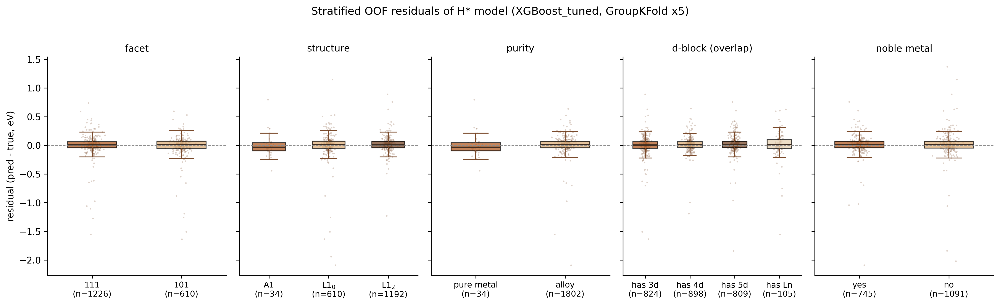

# 20. 主线 H* 模型分层误差分析

补齐原方案第 10 周缺口："重点检查不同金属类别、不同晶面上的预测偏差"。

## 方法口径

- 数据：`data_processed/hstar_dataset_v2.csv`（1,836 行 × 36 特征，`site_spread` 泄漏特征禁入）。
- 模型：XGBoost_tuned（lr=0.03 / depth=7 / n_estimators=400 / subsample=0.8，取自 `hstar_best_params.json`，种子 42）。
- 预测：GroupKFold(5, groups=规范化 comp) 的 out-of-fold 预测，与 07 脚本的 group CV 口径一致。
- 残差定义：`residual = pred − true`；bias 为残差均值（>0 表示系统性高估吸附能/低估吸附强度）。
- 全体 OOF：**MAE = 0.120 eV，bias = +0.001 eV，RMSE = 0.239 eV**。

## 分层结果

### 按晶面 / 结构（注意：两者在本数据集完全绑定）

| 层 | n | MAE | bias | RMSE |
|---|---|---|---|---|
| facet 111 | 1,226 | 0.118 | +0.001 | 0.229 |
| facet 101 | 610 | 0.124 | +0.002 | 0.257 |
| A1 | 34 | 0.135 | −0.003 | 0.207 |
| L1₀ | 610 | 0.124 | +0.002 | 0.257 |
| L1₂ | 1,192 | 0.117 | +0.001 | 0.230 |

**诚实说明**：本数据集中 facet 与 structure 一一绑定（A1→111、L1₀→101、L1₂→111），因此"晶面效应"与"结构效应"无法分离——101 与 L1₀ 的分层数字完全相同。同样，34 个纯金属恰好全部是 A1 纯金属，纯度分层与 A1 分层也完全重合。各层 MAE 差异 ≤0.018 eV，bias 全部 ≈0，说明模型在不同晶面/结构上**无系统性偏差**，差异主要在尾部方差（101/L1₀ 的 RMSE 高 12%）。

### 按纯度

| 层 | n | MAE | bias | RMSE |
|---|---|---|---|---|
| 纯金属 (n_elements=1) | 34 | 0.135 | −0.003 | 0.207 |
| 合金 | 1,802 | 0.120 | +0.001 | 0.240 |

纯金属 MAE 略高但 RMSE 反而最低（无极端离群）；n=34 样本量小，差异不具统计意义。

### 按周期类别（可叠加：一个组成可同时含多个周期的 d 区元素）

| 层 | n | MAE | bias | RMSE |
|---|---|---|---|---|
| 含 3d | 824 | **0.132** | −0.009 | **0.276** |
| 含 4d | 898 | 0.098 | +0.001 | 0.199 |
| 含 5d | 809 | 0.110 | +0.006 | 0.217 |
| 含镧系 | 105 | **0.146** | +0.006 | 0.259 |

口径：3d=Sc–Zn，4d=Y–Cd，5d=Hf–Hg（La 归入镧系不计 5d）；数据集内镧系仅 La（n=105 即含 La 的全部样本）；非 d 区元素（Al/Ga/In/Sn/Pb/Bi/Tl）不进任何周期层。
**误差最大的一层是"含 3d"与"含镧系(La)"**：MAE 分别比含 4d 层高 35% 和 49%。3d 层 bias=−0.009 是唯一可见的小幅系统性低估吸附能（预测吸附偏强）信号。与 LOEO 结果一致：Mn（MAE 0.482）、Fe（0.283）、Cr（0.185）均属 3d，La 层误差高则对应 La 的 LOEO MAE 0.218 及强亲氧化学。

### 按贵金属

| 层 | n | MAE | bias | RMSE |
|---|---|---|---|---|
| 含贵金属 (Ru/Rh/Pd/Ag/Os/Ir/Pt/Au) | 745 | 0.108 | +0.001 | 0.223 |
| 不含贵金属 | 1,091 | 0.128 | +0.001 | 0.250 |

含贵金属体系误差低 ~16%，与文献一致：贵金属表面是数据集与文献覆盖最充分的区域，且其吸附能分布集中在模型学习最好的近零区间。

## 最差个案（|残差| top-20，全表见 `outputs/errana_worst20.csv`）

共性非常集中：

- **12/20 带红旗**（与候选表 red_flags 同一逻辑）；**10/20 含 LOEO 高误差元素 Mn/Bi/Fe**（其中含 Mn 的有 7 条，Mn 是 LOEO 最差元素，MAE 0.482 eV）。
- **17/20 残差为负**（pred < true）：14/20 真值 E > +0.8 eV（H 吸附极弱的极端体系，全数据集 |E|>1 eV 的仅占 13.8%），模型把极端值往分布中心压——这是树模型对稀疏极端化学的固有回归均值行为。
- 其余共性：重 p 区元素 Tl 出现 4 次（Co3Tl/Tl3W/ReTl3/IrTl3，Tl 的 LOEO MAE 0.220 排第 6）；Bi 出现 2 次。最差 3 名全部是 Mn 的 L1₀(101) 合金（AuMn/MnPb/AgMn，真值 +2.4~+2.7 eV，模型只给到 +0.5~+0.7 eV）。

逐条诊断（节选）：

| comp | 真值 | 预测 | 残差 | 可能原因 |
|---|---|---|---|---|
| AuMn | 2.736 | 0.644 | −2.09 | Mn 极端化学（LOEO 最差），+2.7 eV 超出训练分布主体，被压向均值 |
| MnPb | 2.739 | 0.718 | −2.02 | 同上；Pb 为重 p 区，Mn+弱吸 p 金属组合样本稀少 |
| AgMn | 2.437 | 0.494 | −1.94 | 同上 |
| Bi3Re | 1.123 | −0.719 | −1.84 | Bi 为 LOEO 高误差元素（0.279）；Bi(半金属)+Re 的电子结构超出组成统计特征表达能力 |
| Fe3In | 1.774 | −0.009 | −1.78 | Fe 为 LOEO 高误差元素（0.283）；磁性 3d 元素 d 电子态未被标量特征捕捉 |
| CrMn | −2.308 | −0.734 | +1.57 | 双 3d 强吸附极端（数据集最低真值），被压向均值 |
| LaNi3 | 1.154 | −0.402 | −1.56 | La 强亲氧（红旗），镧系仅 105 样本，f/5d 化学欠表达 |
| BiMn | 0.456 | 1.603 | +1.15 | 双红旗元素叠加（Bi+Mn），方向相反的正残差 |

## 结论：模型在哪些体系上最不可靠

1. **含 3d 磁性元素（尤其 Mn/Fe/Cr）的体系**——分层 MAE 最高（0.132 eV）、RMSE 最大（0.276 eV），top-20 中占一半；组成统计特征（电负性/d 电子数均值与极值）无法表达 3d 磁性与强关联电子效应。
2. **含镧系（La）与强亲氧元素（La/Y/Sc）的体系**——MAE 0.146 eV，样本少（105 条）且化学特殊。
3. **极端弱吸附（E > +1 eV）的尾部体系**——含 Mn/Bi/Fe/Tl/Pb 组合的 L1₀(101) 合金，模型系统性低估吸附能 1~2 eV；这些恰是 HER 筛选中"不吸附 H"的一端，对 ΔG_H≈0 的候选排序影响有限，但若用于全范围吸附能预测需明确标注外推风险。
4. 相反，**贵金属体系、4d 体系、L1₂(111) 主流组成**是最可靠区间（MAE 0.10–0.12 eV，bias≈0）。

实用建议沿用候选表的红旗机制：含 Mn/Bi/Fe/La/Y/Sc/Tc 的预测一律标注低置信；对 E > +1 eV 的极端值输出应视为半定量。

## 产物清单

- `figures/errana_stratified_box.png`（五维分层残差箱线图，300 dpi，低饱和暖色系）
- `outputs/errana_by_facet.csv`、`errana_by_structure.csv`、`errana_by_category.csv`（分层 n/MAE/bias/RMSE）
- `outputs/errana_worst20.csv`（top-20 最差个案含红旗与 LOEO 对照）
- `outputs/errana_summary.json`（汇总指标，供复用）
- 脚本：`scripts/19_error_analysis.py`
